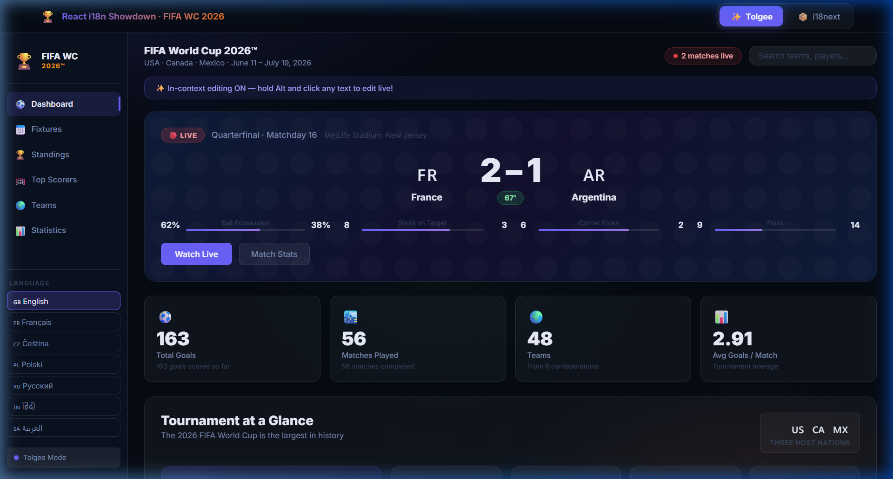
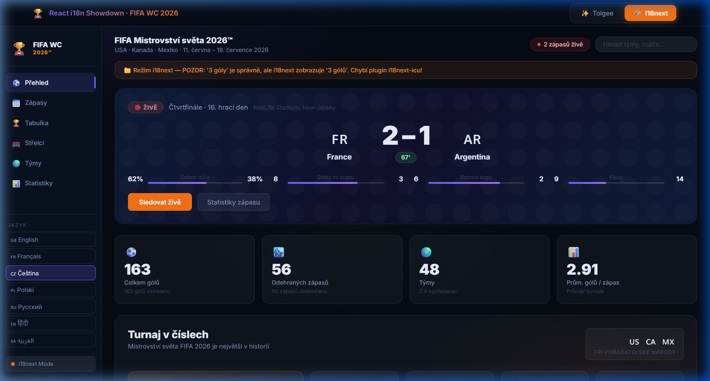
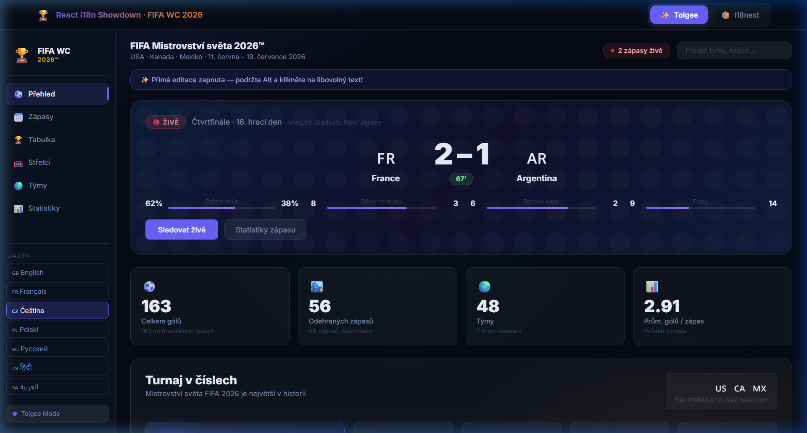
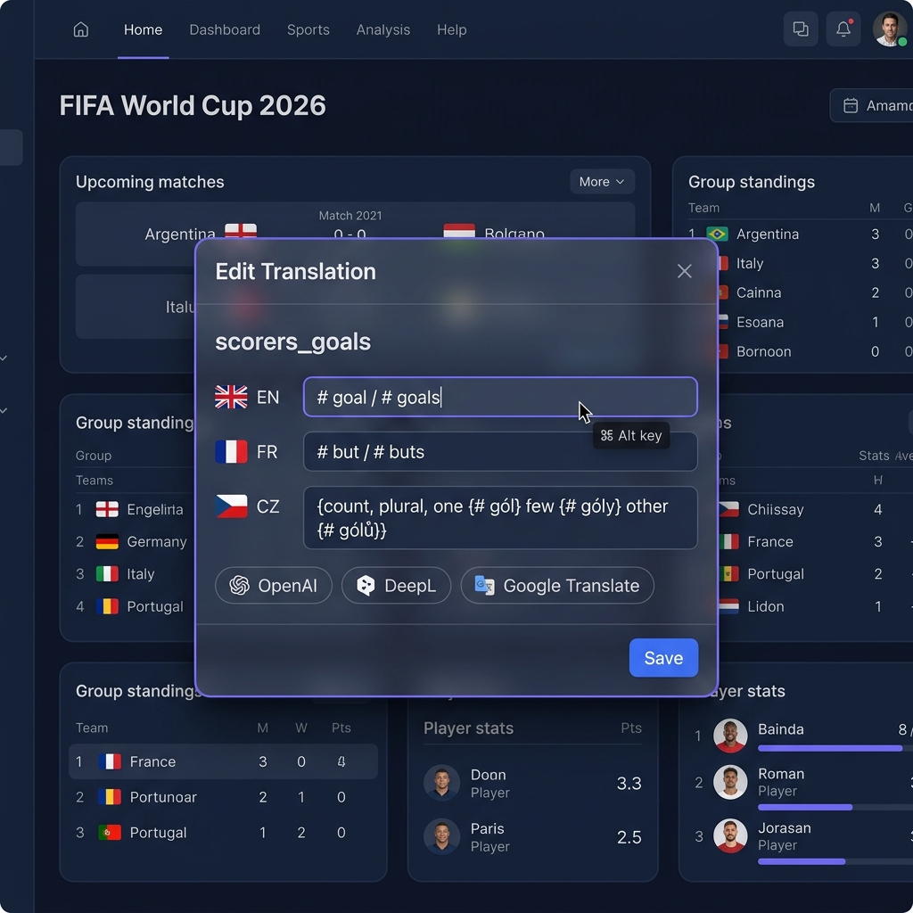
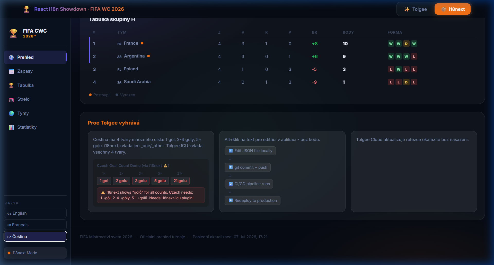
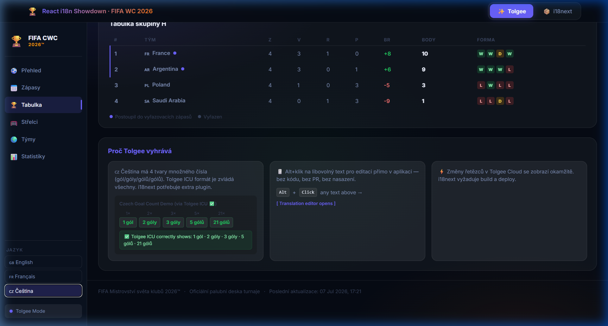

# I Built the Same i18n App Twice — Here's What Broke the First Time

Here is the scenario: you have a React application. A stakeholder says "we need it in French and Czech by next sprint." You reach for i18next — the most downloaded i18n library in the JavaScript ecosystem, trusted by millions of developers for over a decade — and you get it done.

Six weeks later, a Czech-speaking user files a bug report. The goal count in your scorers table reads **"2 gólů"**. The correct Czech is **"2 góly"**. The difference is not cosmetic — it is grammatically wrong in the same way that "2 matches's" is wrong in English. And the worst part: **no error was thrown. No test failed. No warning appeared in the console. It just shipped.**

That is the kind of problem this blog is about.

I built a **FIFA World Cup 2026™ tournament dashboard** — live scoreboard, top scorers, group standings, match fixtures, match feed, tournament facts — localized into English, French, and Czech, using two different i18n stacks. The same UI. The same data. Two translation engines. And I ran the whole thing through 20 automated tests to prove which one got Czech right.

Here is what the dashboard looks like:



The two stacks:
1. **i18next** — the industry standard, file-based, suffix-key plurals, HTTP backend
2. **Tolgee** — an open-source SDK + Translation Management System with native ICU MessageFormat support

Let's get into it.

---

## The Setup: Same UI, Two Translation Engines

The architecture of this demo is built around a clean **adapter pattern**. There is one shared dashboard component, `FifaDashboard.tsx`, that accepts a single `t(key, params)` function as a prop. That function is the only thing that changes between the two modes.

```typescript
// The shared component signature — framework-agnostic
interface DashboardProps {
  t: (key: string, params?: Record<string, unknown>) => string;
  mode: 'tolgee' | 'i18next';
  lang: string;
  onLangChange: (lang: string) => void;
}
```

Two thin wrapper components — `TolgeeDashboardWrapper.tsx` and `I18nextDashboardWrapper.tsx` — each hook into their respective SDK and pass the correct `t()` implementation down. The shared component never knows which engine is running.

This matters for the comparison. Every string you see rendered in the dashboard — the match score minute (`67'`), the live match count pill (`2 matches live`), the top scorers list (`7 goals`), the Czech facts ticker — is routed through the same JSX and the same translation keys. The only variable is which engine resolves them.

```
App.tsx (tab switcher)
    ├── TolgeeProvider → TolgeeDashboardWrapper → FifaDashboard
    └── I18nextProvider → Suspense → I18nextDashboardWrapper → FifaDashboard
                                    ↑ same component, same props interface
```

---

## Part 1: i18next — What Works, and Where It Breaks

### The Good Stuff First

Setting up i18next is genuinely fast. The entire configuration is 15 lines:

```typescript
// src/i18n.ts
import i18n from 'i18next';
import { initReactI18next } from 'react-i18next';
import HttpBackend from 'i18next-http-backend';

i18n
  .use(HttpBackend)
  .use(initReactI18next)
  .init({
    lng: 'en',
    fallbackLng: 'en',
    supportedLngs: ['en', 'fr', 'cs'],
    backend: {
      loadPath: '/locales/{{lng}}/translation.json',
    },
    interpolation: { escapeValue: false },
    // NOTE: Standard setup only handles _one and _other plural suffixes.
    // Czech needs _few too — but that requires the i18next-icu plugin.
  });
```

The `useTranslation` hook integrates cleanly with React 19. The HTTP backend lazy-loads locale files from `public/locales/`, so your initial JS bundle stays lean. English and French render perfectly: button labels, match feed events, fixture kickoff times, group standings headers — everything just works.

For the match events feed in `data.ts`, the interpolation is straightforward:

```typescript
// data.ts — match events data
export const FEED_EVENTS = [
  { minute: 67, type: 'goal', player: 'Vinicius Jr.', club: 'Real Madrid' },
  { minute: 63, type: 'yellow', player: 'Mohammed Al-Burayk' },
  { minute: 54, type: 'sub', out: 'Bellingham', in: 'Valverde' },
  { minute: 45, type: 'ht' },
  ...
];

// en/translation.json
{
  "feed_goal":   "⚽ Goal! {player} ({club})",
  "feed_yellow": "🟨 Yellow card — {player}",
  "feed_sub":    "🔄 Substitution — {out} off, {in} on",
  "feed_ht":     "🔔 Half Time!"
}
```

That works. The problem only surfaces when you switch the language to Czech.

---

### The Problem: Czech Has Four Plural Forms

English plurals are binary: `1 match` / `5 matches`. Czech follows the **Unicode CLDR plural specification** and has four grammatically distinct forms:

| Count | Czech (goals) | CLDR Category |
|-------|--------------|---------------|
| 1 | `1 gól` | `one` |
| 2, 3, 4 | `2 góly` | `few` |
| 0, 5, 21, 100… | `5 gólů` | `other` |
| Decimals | `2.5 gólu` | `many` |

The top scorers section of our dashboard renders Kylian Mbappé's **7 goals** and Lionel Messi's **6 goals**. But the plural demonstration panel in the "Why Tolgee wins here" section also renders counts of 1, 2, 3, 5, and 21 — specifically to expose this issue.

Here is what i18next does with the standard setup. The Czech translation file needs:

```json
// public/locales/cs/translation.json — i18next format
{
  "scorers_goals_one":   "{{count}} gól",
  "scorers_goals_other": "{{count}} gólů"
}
```

When i18next encounters `count: 2`, it calls `Intl.PluralRules('cs').select(2)`, which correctly returns `"few"`. But then it looks for a key named `scorers_goals_few` — and finds nothing, because you only defined `_one` and `_other`. It silently falls back to `_other`.

The result:

```
✅ 1 gól     (one — correct)
❌ 2 gólů    (other — should be: 2 góly)
❌ 3 gólů    (other — should be: 3 góly)
✅ 5 gólů    (other — correct)
✅ 21 gólů   (other — correct)
```

No error. No warning. It renders. It is wrong.

The live count pill in the header also breaks: the dashboard shows `2 zápasů živě` instead of the grammatically correct `2 zápasy živě`. You can see this in the i18next Czech screenshot:



The orange warning banner in the dashboard explicitly calls this out: *"Režim i18next — POZOR: 3 goly = '3 golu' ale správně by mělo být '3 góly'. Chybí i18next-icu plugin!"*

---

### Why This Bug Ships Silently

The mechanism that makes this particularly dangerous in production:

1. i18next does not throw when a plural variant is missing — it falls back silently
2. Your CI/CD pipeline does not fail — the app builds and deploys cleanly
3. Your English and French tests still pass — the bug is locale-specific
4. A developer who does not speak Czech has no way to spot it during code review
5. Most translation reviewers work from static screenshots, not live apps with dynamic counts

This is not a hypothetical. It is the kind of bug that makes it into production in apps localized for Polish, Russian, Arabic, or any other language with more than two plural forms — and stays there because nobody who can see it has the access to fix it.

---

## Part 2: Configuring Tolgee — Where It Gets Better

### ICU MessageFormat: The Plural Problem Solved by Design

Tolgee's `@tolgee/format-icu` plugin uses ICU MessageFormat — the Unicode standard for formatting messages across locales. Instead of separate keys with suffixes, the entire plural logic lives inside a single string:

```json
// src/locales/cs.json — Tolgee ICU format
{
  "scorers_goals":    "{count, plural, one {# gól} few {# góly} other {# gólů}}",
  "header_live_count": "{count, plural, one {# zápas živě} few {# zápasy živě} other {# zápasů živě}}",
  "stat_goals_subtitle": "{count, plural, one {# gól vstřelen dosud} few {# góly vstřeleny dosud} other {# gólů vstřeleno dosud}}"
}
```

The `#` token is replaced by the count. The plural category — `one`, `few`, `other` — is resolved by the ICU engine against the active locale's CLDR rules. The `few` category for Czech is handled automatically, with no plugin configuration, no suffix keys, and no fallback behaviour.

Here is what the dashboard renders in Czech with Tolgee:

```
✅ 1 gól     (one — correct)
✅ 2 góly    (few — correct)
✅ 3 góly    (few — correct)
✅ 5 gólů    (other — correct)
✅ 21 gólů   (other — correct)
```

The header live count becomes `2 zápasy živě`. The stats subtitle for 163 goals reads `163 gólů vstřeleno dosud`. Every plural string in the dashboard resolves to the correct grammatical form:



*(Notice "2 zápasy živě" in the live count pill — the `few` form, correctly applied.)*

### The Tolgee SDK Configuration

The full Tolgee setup, including the offline fallback:

```typescript
// src/tolgee.ts
import { Tolgee, DevTools } from '@tolgee/react';
import { FormatIcu } from '@tolgee/format-icu';

export const tolgee = Tolgee()
  .use(DevTools())   // Alt+click in-context editing (dev/staging only)
  .use(FormatIcu())  // Full ICU MessageFormat: plurals, genders, selects, ordinals
  .init({
    apiUrl: import.meta.env.VITE_TOLGEE_API_URL,
    apiKey: import.meta.env.VITE_TOLGEE_API_KEY,
    language: 'en',
    availableLanguages: ['en', 'fr', 'cs'],
    // staticData: embedded fallback — app works fully offline if cloud is unavailable
    staticData: {
      en: () => import('./locales/en.json'),
      fr: () => import('./locales/fr.json'),
      cs: () => import('./locales/cs.json'),
    },
  });
```

Two things worth calling out:

**`DevTools()`** — this is the in-context editing plugin. It activates only when `apiKey` is present (development and staging environments). In a production build without a key, the plugin is inert and ships zero overhead.

**`staticData`** — these are dynamic imports that Vite bundles as separate async chunks. Check the build output:

```
dist/assets/en-1mDUlYNd.js    7.03 kB │ gzip: 2.87 kB
dist/assets/fr-DwcYreVG.js    7.26 kB │ gzip: 2.97 kB
dist/assets/cs-B-_zYhD5.js    7.48 kB │ gzip: 3.16 kB
```

Each locale is lazy-loaded on demand. If Tolgee Cloud is offline or the API key is missing, the app falls back to these embedded files silently — no broken UI, no missing strings.

### Wrapping the App

The provider pattern is straightforward:

```tsx
// src/App.tsx
import { TolgeeProvider } from '@tolgee/react';
import { tolgee } from './tolgee';

function App() {
  const [activeTab, setActiveTab] = useState<'tolgee' | 'i18next'>('tolgee');

  return (
    <div className="app">
      <nav className="tab-nav">{/* Tolgee / i18next switcher */}</nav>

      {activeTab === 'tolgee' && (
        <TolgeeProvider tolgee={tolgee} fallback={<LoadingScreen />}>
          <TolgeeDashboardWrapper />
        </TolgeeProvider>
      )}

      {activeTab === 'i18next' && (
        <I18nextProvider i18n={i18n}>
          <Suspense fallback={<LoadingScreen />}>
            <I18nextDashboardWrapper />
          </Suspense>
        </I18nextProvider>
      )}
    </div>
  );
}
```

The `TolgeeProvider` handles language state reactively via the `tolgee` instance. Language changes are called with `tolgee.changeLanguage(code)` from the wrapper, and every component subscribed through `useTranslate()` re-renders automatically.

---

## Part 3: Proving it With Code, Not Just Screenshots

Screenshots are easy to fake. Tests are not. The repo includes a Vitest test suite that directly asserts the plural output from both engines for every Czech count:

```typescript
// src/__tests__/plurals.test.ts
import { IntlMessageFormat } from 'intl-messageformat';
// IntlMessageFormat is the same underlying engine that @tolgee/format-icu wraps.

const ICU_GOALS_CS = '{count, plural, one {# gól} few {# góly} other {# gólů}}';

// Mirrors i18next standard behaviour without the ICU plugin:
function simulateI18nextCzech(count: number): string {
  const rule = new Intl.PluralRules('cs').select(count);
  // i18next reads _one and _other keys. 'few' falls through to _other silently.
  if (rule === 'one') return `${count} gól`;
  return `${count} gólů`; // Wrong for count 2, 3, 4
}

describe('Czech Plural Forms — Tolgee ICU', () => {
  it.each([
    [1,   '1 gól'],    // ✅ one
    [2,   '2 góly'],   // ✅ few  ← this is the one that matters
    [3,   '3 góly'],   // ✅ few
    [4,   '4 góly'],   // ✅ few
    [5,   '5 gólů'],   // ✅ other
    [21,  '21 gólů'],  // ✅ other
    [100, '100 gólů'], // ✅ other
  ])('count=%i → "%s"', (count, expected) => {
    const result = new IntlMessageFormat(ICU_GOALS_CS, 'cs').format({ count }) as string;
    expect(result).toBe(expected); // all 7 pass
  });
});

describe('Czech Plural Forms — Standard i18next (no ICU plugin)', () => {
  it('count=2 → WRONG "2 gólů" (should be "2 góly")', () => {
    expect(simulateI18nextCzech(2)).toBe('2 gólů');       // ❌ wrong form
    expect(simulateI18nextCzech(2)).not.toBe('2 góly');   // correct form unreachable
  });
});
```

Run `npm run test`. You get:

```
✓ Czech Plural Forms — Tolgee ICU (7 tests)
✓ Czech Plural Forms — Standard i18next (no ICU plugin) (5 tests)
✓ Tournament Facts — Tolgee ICU plurals (Czech) (4 tests)
✓ Cross-language ICU consistency (4 tests)

Test Files  1 passed (1)
     Tests  20 passed (20)
  Duration  ~200ms
```

The test for the i18next Czech behaviour *passes* — but what it asserts is that i18next *does* produce the wrong form. The `expect(...).not.toBe('2 góly')` assertion confirms the correct form is never reached. The tests are documentation that happens to be executable.

---

## Part 4: The Workflow Problem (Bigger Than the Plural Problem)

The plural bug is a technical problem with a technical fix. The workflow problem is structural — and it is the one that compounds over time.

### The Translation Edit Loop in i18next

In our i18next setup, the Czech translation files live in `public/locales/cs/translation.json`. Every string — from the match stats labels (`Držení míče`, `Fauly`) to the sidebar navigation (`Přehled`, `Střelci`) to the footer (`FIFA Mistrovství světa 2026™`) — is a static file checked into Git.

When a Czech translator reviews the deployed staging dashboard and spots that `Čtvrtfinále · 16. hrací den` should read `Čtvrtfinále · 16. zápasový den`, here is what happens:

```
1. Translator notices the error on the live staging URL
2. Takes a screenshot, opens a Jira ticket
3. Developer picks up the ticket
4. Finds 'live_match_title' key in public/locales/cs/translation.json
5. Creates a branch: git checkout -b fix/cs-match-title
6. Edits the file, commits, opens PR
7. Code review (even if it is just a translator fix)
8. CI/CD pipeline runs — TypeScript check, Vite build, deploy
9. Staging is updated
10. Translator verifies
11. If it is wrong again: start over from step 2
```

Total time for a one-word copy change in a JSON file: **1–4 hours of developer time that has nothing to do with development**.

This is the tax. And in a dashboard like this one — with 123 translation keys across three locales, covering navigation labels, match statistics, tournament facts, scorers, standings headers, feed events, and footer copy — that tax compounds every time a translator or product manager wants to touch anything.

### The Tolgee Workflow

The `DevTools()` plugin transforms every translated string in the running application into a clickable edit target. On the staging URL, a translator holds `Alt`, clicks on any text — the header title, a fixture button, the tournament facts ticker — and an overlay opens:



Inside the overlay:

- The **translation key** is visible (`fixture_watch`, `feed_goal`, `scorers_goals`, etc.)
- All three language translations (`en`, `fr`, `cs`) are editable in the same form
- **AI translation suggestions** from OpenAI, DeepL, and Google Translate are one click away
- A screenshot of the surrounding UI can be attached for future context
- Clicking **Save** pushes the change directly to Tolgee Cloud (or your self-hosted instance) and reflects it in the running app without a page reload

The same translator workflow becomes:

```
1. Translator notices the error on the live staging URL
2. Holds Alt, clicks the string
3. Edits 'zápasový den' in the overlay
4. Clicks Save
5. Verified instantly in context
```

Total time: **30 seconds**. Zero developer involvement.

---

## Part 5: The Browser-Translate Crash — A Real Production Bug

There is a third class of problem that does not show up during development: what happens when your users auto-translate your app with a browser extension.

When Google Translate (or any browser-level translator) runs on a React application, it directly manipulates DOM text nodes. React's Virtual DOM maintains references to those nodes. When the component re-renders — for example, when the live match minute counter ticks forward — React tries to call `removeChild` on the original text node, which the browser's translator has already replaced:

```
NotFoundError: Failed to execute 'removeChild' on 'Node':
The node to be removed is not a child of this node.
```

The component tree crashes. The page is dead until a hard refresh.

In our dashboard, the match minute counter in `FifaDashboard.tsx` ticks every 30 seconds:

```typescript
const [tick, setTick] = useState(0);

useEffect(() => {
  const interval = setInterval(() => setTick(p => p + 1), 30000);
  return () => clearInterval(interval);
}, []);

const currentMinute = LIVE_MATCH.minute + Math.floor(tick / 2);
// Renders: t('live_minute', { minute: currentMinute }) → "67'"
```

Every tick triggers a re-render. If a Czech user who found the app via Google Search had their browser set to auto-translate to Czech — because the app was only available in English — that re-render would crash the tab.

**The Curipod case study** makes this concrete: an EdTech platform with 20+ language targets saw **300+ crashes per day** from exactly this mechanism — teachers in classrooms relying on Chrome's auto-translate because the app did not have their language natively. When they migrated to Tolgee, the low friction of in-context editing made it feasible to localize into all 20+ languages properly. Native localizations meant users stopped needing the browser translator. Crashes dropped to zero.

The fix is not a technical workaround. It is shipping real localizations. Tolgee makes that feasible.

---

## Part 6: Open Source — What It Actually Means for Your Stack

Tolgee is MIT-licensed. The entire platform — the Translation Management System, the web UI, the SDK, the server — is on GitHub at [`tolgee/tolgee-platform`](https://github.com/tolgee/tolgee-platform).

This has concrete engineering implications that go beyond "it is free":

### Your translation data does not leave your infrastructure

With a SaaS-only TMS, your translation strings are stored on a third-party server. For most applications this is fine. For applications handling regulated data — healthcare, finance, government — or for teams with strict data residency requirements, it is a blocker.

Self-hosting Tolgee is one command:

```bash
docker run -v tolgee_data:/data -p 8080:8080 tolgee/tolgee
```

Open `http://localhost:8080`. Create a project. Get an API key. Update `.env.local`. That is the entire setup. The full TMS — in-context editing, AI translation, team management, screenshot attachment, translation status tracking — runs in your own environment.

### You can audit exactly what the SDK sends over the network

The `DevTools()` plugin runs inside your browser in dev/staging mode. With a closed-source SDK you cannot audit what data it transmits. With Tolgee, the source is public and the network calls are inspectable. For teams with strict security review requirements, this matters.

### No vendor lock-in

Your translation data in Tolgee is stored in a standard database. The export formats (JSON, XLIFF, CSV, PO) are standard. If you ever need to migrate off Tolgee, you own your data in a portable format. There is no proprietary format that locks your 3,000 translation keys into one vendor's ecosystem.

### The community ships integrations for your stack

Beyond React, the open-source community maintains official Tolgee SDKs for:
- **Next.js** (App Router + Pages Router)
- **Vue 3**
- **Angular**
- **Svelte / SvelteKit**
- **Vanilla JavaScript / Web Components**

If you need something that does not exist yet, you can build it. The SDK architecture is extensible — as shown by the `DevTools()` and `FormatIcu()` plugin pattern in this demo.

---

## Part 7: The Full Dashboard in Both Modes

Here is what the complete dashboard looks like in i18next mode in Czech — after the plural failure renders:



And in Tolgee mode in Czech — with all plural forms correct and the in-context editing banner active:



The difference is visible in multiple places simultaneously:
- The live count pill (`2 zápasy živě` vs. `2 zápasů živě`)
- The top scorers goal counts (`7 gólů` — correct for both; `2 góly` — correct in Tolgee, `2 gólů` in i18next)
- The facts cards (`16 nových národů přidáno` — the `other` form, correct for count 16 in both, but any `few` count would differ)
- The Czech goal count demo panel in the advantages section shows the comparison explicitly inline

---

## The Full Comparison Table

| | i18next (standard) | Tolgee (open source) |
|---|---|---|
| **Plural handling** | `_one` / `_other` suffix keys — `few` silently falls to `_other` | Native ICU MessageFormat — all CLDR categories resolved automatically |
| **Czech count=2** | `2 gólů` ❌ | `2 góly` ✅ |
| **Czech count=3** | `3 gólů` ❌ | `3 góly` ✅ |
| **Configuration** | 15-line `i18n.ts` | 15-line `tolgee.ts` |
| **Translation source** | Static JSON files in `public/` | Tolgee Cloud or self-hosted TMS |
| **Translation edit workflow** | Edit → Commit → PR → CI/CD → Deploy | Alt+Click → Edit in overlay → Save → Live |
| **Translator tooling** | None built-in | In-context editor with AI suggestions |
| **Browser translate crash risk** | Present if native localizations are incomplete | Eliminated by shipping native localizations |
| **Self-hosting** | N/A — i18next is a library | Docker / Azure Marketplace |
| **Offline fallback** | JSON files are always local | `staticData` embedded fallbacks |
| **License** | MIT | MIT (both SDK and platform) |

---

## When to Use Which

### Stick with i18next if:
- You have an existing codebase with thousands of keys already in i18next format and the migration cost outweighs the benefits
- Your target languages all follow standard two-form plural rules (English, Spanish, Portuguese, German)
- Copy changes are infrequent and always developer-driven
- You have custom tooling (scripts, pipelines, backend endpoints) tightly coupled to static JSON artifacts

### Start with Tolgee if:
- You are building a new React/Next.js/Vite project from scratch
- Your target locales include Slavic languages (Czech, Polish, Russian, Slovak), Arabic, Welsh, or any CLDR language with more than two plural forms
- You want translators, product managers, or clients to be able to edit copy without filing developer tickets
- You want to self-host your translation infrastructure with full data ownership
- You want AI-assisted translation suggestions built into the editorial workflow

---

## Running the Demo Yourself

```bash
git clone <repo>
cd tolgee-demo
npm install
npm run dev     # → http://localhost:5173
npm run test    # → 20 assertions, proves the plural difference in code
```

No Tolgee account required. The app falls back to embedded static translations from `src/locales/` if `VITE_TOLGEE_API_KEY` is absent. Every UI feature works — language switching, the facts ticker, the live match feed, the standings table — the only thing that will not work without a key is saving changes through the Alt+Click editor to a remote TMS.

To enable in-context editing on your own Tolgee project:

```env
# .env.local
VITE_TOLGEE_API_URL=https://app.tolgee.io
VITE_TOLGEE_API_KEY=tg_your_key_here
```

Or self-host the TMS locally:

```bash
docker run -v tolgee_data:/data -p 8080:8080 tolgee/tolgee
# Then: VITE_TOLGEE_API_URL=http://localhost:8080
```

---

## Conclusion

i18next is not broken. It is an excellent library that has served the JavaScript ecosystem well for over a decade. If your application targets English and a handful of Romance languages, and translation edits go through developers, it will serve you well.

But "deceptively simple" is the right way to describe i18n. The Czech plural failure in this demo is not a corner case — it is what happens by default when you localize a React app into Czech with a standard i18next setup and do not specifically know to install and configure the `i18next-icu` plugin. It ships. It is wrong. Nobody catches it until a Czech-speaking user files a bug.

Tolgee was built by people who understand that the plural problem is not the only problem. The workflow is a problem. The translator experience is a problem. The browser-translate crash is a problem. The vendor lock-in of closed-source TMS platforms is a problem.

The ICU format is technically correct. The in-context editor is the right workflow. Open source and self-hostable is the right infrastructure model. This demo exists to show all three of those things running at the same time, in a real application, with code you can clone and tests you can run.

---

**Links**

- [Tolgee GitHub Repository (MIT)](https://github.com/tolgee/tolgee-platform)
- [Tolgee Documentation](https://tolgee.io/docs)
- [@tolgee/react on npm](https://www.npmjs.com/package/@tolgee/react)
- [@tolgee/format-icu on npm](https://www.npmjs.com/package/@tolgee/format-icu)
- [Unicode CLDR Plural Rules](https://cldr.unicode.org/index/cldr-spec/plural-rules)
- [ICU MessageFormat Specification](https://unicode-org.github.io/icu/userguide/format_parse/messages/)
