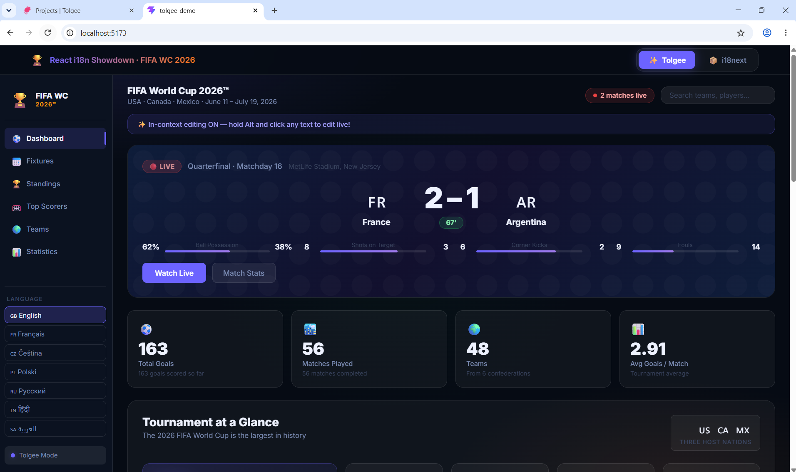

<div align="center">

# React i18n Showdown: Tolgee vs. i18next
### A Developer-First, Code-Driven Comparison — FIFA World Cup 2026™ Dashboard (7 Languages)


</div>

---

> **TL;DR** — We built the same production-grade multilingual dashboard twice: once with **i18next** (the industry standard), once with **Tolgee** (the modern open-source challenger with native ICU MessageFormat). We localized it into **7 languages across 4 writing systems** (`en`, `fr`, `cs-CZ`, `pl`, `ru`, `hi`, `ar`). Complex Slavic 4-form plurals (`one`/`few`/`many`/`other`) and Arabic 6-form plurals (`zero`/`one`/`two`/`few`/`many`/`other`) broke standard i18next silently. Tolgee handled all 7 languages natively with zero extra config.

---

## 📸 Live Application Screenshots

### 1. Full 7-Language FIFA World Cup 2026™ Dashboard


### 2. Live In-Context Editing Overlay (`Alt + Click`)


### 3. Multi-Language Plural Showdown & Language Selection


---

## Table of Contents

1. [The Real Problem with i18n in 2026](#1-the-real-problem-with-i18n-in-2026)
2. [What Worked Well with i18next](#2-what-worked-well-with-i18next)
3. [The Persistent Problems We Hit](#3-the-persistent-problems-we-hit)
4. [How Tolgee Solves Each Problem](#4-how-tolgee-solves-each-problem)
5. [Why Open Source Matters Here](#5-why-open-source-matters-here)
6. [Architecture Overview](#6-architecture-overview)
7. [The Czech Plural Test: Provable with Code](#7-the-czech-plural-test-provable-with-code)
8. [Getting Started](#8-getting-started)
9. [How to Run the Showdown](#9-how-to-run-the-showdown)
10. [Self-Hosting Tolgee](#10-self-hosting-tolgee)
11. [Deploying to Production](#11-deploying-to-production)
12. [Resources](#12-resources)

---

## 1. The Real Problem with i18n in 2026

Every developer who has shipped a multilingual app knows the pattern: you start with a weekend's worth of `en.json` files, and six months later you have a 3,000-key JSON monster, a Slack channel full of "can someone change this button label in Spanish?" requests, and a CI/CD pipeline that redeploys your entire app every time a translator fixes a comma.

The problem isn't the library. i18next is excellent. **The problem is the workflow** — the assumption that developers are the mandatory bottleneck for every single translation change, from architectural refactors to one-word typo fixes.

This project stress-tests that assumption with a real-world use case: a **FIFA World Cup 2026™ tournament dashboard** localized into **7 languages across 4 writing systems** (`en`, `fr`, `cs-CZ`, `pl`, `ru`, `hi`, `ar`) — where complex Slavic four-form plurals (`cs-CZ`, `pl`, `ru`) and Arabic six-form plurals (`ar`) plus right-to-left layout serve as definitive technical acid tests for any i18n library.

---

## 2. What Worked Well with i18next

To be fair: **i18next is a battle-tested library** and it works well for a large class of use cases. Here is what went smoothly:

### ✅ Setup was fast and familiar
The i18next initialization is a single, well-documented call. The React integration via `react-i18next` is mature, the `useTranslation` hook is ergonomic, and HTTP backend loading from the `public/` directory just works.

```typescript
// src/i18n.ts — entire config in 15 lines
import i18n from 'i18next';
import { initReactI18next } from 'react-i18next';
import HttpBackend from 'i18next-http-backend';

i18n
  .use(HttpBackend)
  .use(initReactI18next)
  .init({
    lng: 'en',
    fallbackLng: 'en',
    supportedLngs: ['en', 'fr', 'cs', 'pl', 'ru', 'hi', 'ar'],
    backend: { loadPath: '/locales/{{lng}}/translation.json' },
    interpolation: { escapeValue: false },
  });
```

### ✅ Ecosystem is massive
i18next has been around since 2011. Every edge case is documented. Stack Overflow has answers. The plugin ecosystem covers date formatting, number formatting, and even ICU (via `i18next-icu`). If you are willing to assemble the pieces, the power is there.

### ✅ English and French just worked
For languages that follow the standard Germanic/Romance plural model (`one` / `other`), i18next's default configuration is perfectly adequate. All English and French strings in this dashboard render correctly without any additional setup.

### ✅ React Suspense integration is clean
Wrapping the i18next component tree in a `<Suspense>` boundary for async JSON loading is straightforward and the pattern feels idiomatic in React 18+.

---

## 3. The Persistent Problems We Hit

These are real issues. Not hypothetical edge cases — things that would happen in a production app used by real people in real locales.

---

### ❌ Problem 1: Czech Plurals Are Silently Wrong

Czech has **four plural forms** defined by the Unicode CLDR standard:

| Count | Correct Czech | CLDR Category |
|-------|--------------|---------------|
| 1 | `1 gól` | `one` |
| 2, 3, 4 | `2 góly` | `few` |
| 0, 5, 21, 100… | `5 gólů` | `other` |
| Decimals | (special) | `many` |

i18next's default setup reads `_one` and `_other` suffix keys. It uses `Intl.PluralRules` to resolve the category, but **it does not map `few` to a translation key** — it falls back silently to `_other`.

The result is that a count of `2` or `3` renders as `"gólů"` (genitive plural, used for 5+) instead of `"góly"` (nominative plural, used for 2–4). This is grammatically equivalent to saying "2 matches's" in English — but it ships silently because there is no error, no warning, and the UI still renders.

**This is not i18next's fault** — the standard suffix behavior is documented. But the fact that you need to know to install `i18next-icu` and reconfigure the entire parser to get correct Slavic grammar means most developers ship the wrong form without realizing it.

```json
// What i18next gets from your translation file (standard setup):
{
  "scorers_goals_one":   "{{count}} gól",
  "scorers_goals_other": "{{count}} gólů"
  // ^^ No _few key = counts 2, 3, 4 silently use _other
}
```

---

### ❌ Problem 2: Every Translation Edit Requires a Deployment

In the standard i18next workflow, translations live in JSON files checked into Git. That means:

```
Translator spots a typo
        ↓
Files a ticket / sends a Slack message
        ↓
Developer locates the key in the JSON file
        ↓
Creates a branch, edits the file
        ↓
Opens a Pull Request
        ↓
CI/CD pipeline runs (5–15 minutes)
        ↓
Code review, merge
        ↓
Deployment to production
        ↓
Translator verifies the fix
        ↓
Typo is fixed. Total time: 1–4 hours.
```

For a single-word copy change. This is the real cost of file-based i18n at scale — not the library code, but the **human workflow tax** it imposes on every team member.

---

### ❌ Problem 3: Browser Auto-Translate Causes React Crashes

This is a documented, production-severity bug that most developers don't discover until it is too late.

When a user's browser auto-translates your page (e.g., Chrome's built-in Google Translate), it **directly manipulates DOM text nodes**. React keeps an in-memory Virtual DOM that references those text nodes. When React tries to update a component, it finds that the text nodes it expects are gone — replaced by the browser's translation wrappers — and throws:

```
NotFoundError: Failed to execute 'removeChild' on 'Node':
The node to be removed is not a child of this node.
```

This crashed **300+ sessions per day** at Curipod (an EdTech platform), specifically in classrooms where teachers and students relied on browser translation because the app wasn't localized into their language. The fix? Localize natively so users never need the browser translator.

i18next can solve this — but only if you do the full localization work for every target language. The workflow friction of doing that work is exactly what makes teams ship English-only apps and hope for the best.

---

### ❌ Problem 4: No Visibility for Non-Technical Stakeholders

Translators, product managers, and clients cannot see what a translation will look like until it is deployed. The loop is:

1. Developer ships the new page.
2. Translator reviews the deployed staging URL.
3. Translator sees 12 string issues.
4. Translator lists them in a ticket.
5. Developer makes the changes.
6. Repeat.

The translator is reviewing a static artifact, not the live context. They cannot see whether a translation will overflow a button, break a line, or look wrong next to a specific piece of UI. By the time they can verify the fix, the deployment cycle has already burned hours.

---

### ❌ Problem 5: Translation Files Become Unmaintained Quickly

As a codebase grows, JSON translation files drift. Keys get renamed in code but not in all locale files. Old keys pile up because no one is sure if they are still used. New developers add keys without checking if a similar one already exists. Eventually, you have:

- Duplicate keys with slightly different wording
- Orphaned keys that reference deleted UI
- Untranslated keys that silently fall back to English
- No clear owner for the translation workflow

None of this is specific to i18next — it is an inherent property of treating translation files as source code artifacts rather than managed content.

---

## 4. How Tolgee Solves Each Problem

Tolgee is built around a single insight: **translation is a content problem, not a code problem**. It ships an SDK (for developers) and a Translation Management System (for everyone else) as a single coherent product.

---

### ✅ Solution 1: Native ICU MessageFormat — Czech Plurals Just Work

Tolgee's `@tolgee/format-icu` plugin uses the `IntlMessageFormat` standard (the same engine that powers Unicode's reference implementation). All plural forms — `one`, `few`, `many`, `other` — are defined **inside the string itself**, not as separate keys.

```json
// src/locales/cs.json — Tolgee format
{
  "scorers_goals": "{count, plural, one {# gól} few {# góly} other {# gólů}}"
}
```

The entire plural logic is self-contained, portable, and correct. No suffix keys. No plugins to install separately. No silent fallbacks. The ICU spec covers Arabic (6 plural forms), Russian, Polish, Welsh, and every other CLDR-defined plural category out of the box.

The Tolgee SDK configuration is five lines:

```typescript
// src/tolgee.ts
export const tolgee = Tolgee()
  .use(DevTools())   // enables Alt+click in-context editing in dev/staging
  .use(FormatIcu())  // full ICU MessageFormat: plurals, genders, selects
  .init({
    apiUrl: import.meta.env.VITE_TOLGEE_API_URL,
    apiKey: import.meta.env.VITE_TOLGEE_API_KEY,
    language: 'en',
    availableLanguages: ['en', 'fr', 'cs-CZ', 'pl', 'ru', 'hi', 'ar'],
    staticData: {             // offline fallback — works without Tolgee Cloud
      en:      () => import('./locales/en.json'),
      fr:      () => import('./locales/fr.json'),
      'cs-CZ': () => import('./locales/cs-CZ.json'),
      pl:      () => import('./locales/pl.json'),
      ru:      () => import('./locales/ru.json'),
      hi:      () => import('./locales/hi.json'),
      ar:      () => import('./locales/ar.json'),
    },
  });
```

---

### ✅ Solution 2: In-Context Editing — Zero Deploy for Translation Changes

The `DevTools()` plugin turns every string in your app into an editable element. In development or staging mode, any team member (developer, translator, product manager, or client) can:

1. Hold `Alt` (or `Option` on macOS)
2. Click on any text in the running app
3. Edit it directly in the overlay that appears
4. Click **Save**

The change is pushed immediately to Tolgee Cloud (or your self-hosted instance) and reflected in the app — no code changes, no Git commits, no CI/CD run, no deployment.

The workflow becomes:

```
Translator spots a typo
        ↓
Alt+Click the text
        ↓
Edit in the overlay dialog
        ↓
Click Save
        ↓
Typo is fixed. Total time: 30 seconds.
```

---

### ✅ Solution 3: Native Localization Eliminates Browser-Translate Crashes

Because Tolgee makes it genuinely fast to localize into many languages — via in-context editing, AI-assisted translation, and the TMS platform — teams are far more likely to actually ship native localizations for all their target languages. When your app is natively localized, users have no reason to use browser auto-translate. No browser DOM manipulation. No React Virtual DOM crash.

This is the solution Curipod used to eliminate 300+ daily crashes.

---

### ✅ Solution 4: Translators Work in Context, Not in Files

Because the in-context editor overlays directly on the running application, translators see exactly what their translation will look like before saving. They can verify that it fits the button, does not overflow the card, and reads correctly in the surrounding context. No ticketing loop. No back-and-forth with developers.

Tolgee also supports screenshots: the editor can automatically capture the surrounding UI and attach it to the translation key in the TMS, giving future translators visual context for every string.

---

### ✅ Solution 5: The TMS Manages Translation State as Data

In the Tolgee Translation Management System (self-hosted or cloud), every translation key is a managed record with:

- **Status tracking**: Draft → In Review → Translated → Approved
- **History**: every change is versioned
- **Orphan detection**: keys that exist in the TMS but no longer appear in the codebase can be identified and cleaned up
- **Duplicate flagging**: similar strings can be grouped and translated once
- **Role-based access**: translators get translator access, developers get developer access, clients get read-only or limited edit access

Translation state is no longer buried in Git history inside JSON files.

---

## 5. Why Open Source Matters Here

Tolgee is **fully open source** — both the SDK and the entire Translation Management System platform. The GitHub repository is at [`tolgee/tolgee-platform`](https://github.com/tolgee/tolgee-platform).

This matters for several concrete engineering reasons:

### You own your data
With a SaaS-only translation platform, your translation strings — including product copy, marketing content, and UI text — live on a third party's servers under their terms of service. With Tolgee, you can self-host the entire stack and keep your data inside your own infrastructure.

### You can audit the code
The in-context editing overlay runs inside your application. With a closed-source SDK, you cannot inspect what data it sends over the network in production. Tolgee's SDK is MIT-licensed and fully auditable.

### No vendor lock-in on the TMS
If Tolgee's managed cloud service discontinued tomorrow, your self-hosted instance would continue working unchanged. Your translation data is yours, in a standard format, in a database you control.

### Self-hosting is a single Docker command
```bash
docker run -v tolgee_data:/data -p 8080:8080 tolgee/tolgee
```
Open `http://localhost:8080`, create an admin account, create a project, and you have the full TMS running locally — including the in-context editor, AI translation, screenshot attachment, and team management features.

For enterprise environments, Tolgee also offers a **pre-packaged Azure Marketplace deployment** for teams that need Azure-native infrastructure with SLA guarantees.

### Community and contribution
Because it is open source, the community can and does contribute fixes, language support, and framework integrations. If your use case requires something that does not exist yet, you can build it and submit a PR rather than waiting on a vendor roadmap.

---

## 6. Architecture Overview

The project is architected around a clean **adapter pattern** that allows the same dashboard UI to be driven by either translation engine at runtime:

```
┌─────────────────────────────────────────────────────────┐
│                    App.tsx (Tab Switcher)                │
└───────────────┬─────────────────────────────────────────┘
                │
     ┌──────────┴──────────┐
     │                     │
┌────▼─────────────┐  ┌────▼─────────────┐
│  TolgeeProvider  │  │  I18nextProvider  │
│  + DevTools()    │  │  + HttpBackend    │
│  + FormatIcu()   │  │  + Suspense       │
└────┬─────────────┘  └────┬─────────────┘
     │                     │
┌────▼─────────────────────▼─────────────┐
│    FifaDashboard (shared component)    │
│    t(key, params) — same interface     │
│    for both engines                    │
└────────────────────────────────────────┘
```

**Why this matters for the comparison:** Both engines render the exact same JSX. The only variable is which `t()` function is passed as a prop. This makes the comparison honest — there is no UI bias toward either implementation.

### File Structure

```
tolgee-demo/
├── src/
│   ├── __tests__/
│   │   └── plurals.test.ts           ← 27 automated plural assertions across 7 locales
│   ├── components/
│   │   ├── FifaDashboard.tsx          ← Shared UI (adapter pattern + RTL support)
│   │   ├── TolgeeDashboardWrapper.tsx ← Tolgee t() adapter
│   │   └── I18nextDashboardWrapper.tsx← i18next t() adapter
│   ├── locales/                       ← Tolgee ICU static fallbacks
│   │   ├── en.json / fr.json / hi.json
│   │   ├── cs-CZ.json / pl.json / ru.json ← Slavic 4-form plurals
│   │   └── ar.json                    ← Arabic 6-form plurals
│   ├── data.ts                        ← Shared match/tournament data
│   ├── tolgee.ts                      ← Tolgee SDK config
│   └── i18n.ts                        ← i18next config
├── public/
│   └── locales/                       ← i18next JSON files (loaded async)
│       ├── en / fr / hi / cs / pl / ru / ar
└── .env.local                         ← VITE_TOLGEE_API_KEY etc.
```

---

## 7. The Czech Plural Test: Provable with Code

The plural comparison is not just a visual demo — it is backed by **20 automated Vitest assertions** in `src/__tests__/plurals.test.ts`.

### The test approach

The test suite uses `intl-messageformat` (the same underlying engine that `@tolgee/format-icu` wraps) to run Tolgee's ICU strings, and a function that mirrors i18next's standard suffix-key resolution to simulate i18next's output — without needing to spin up a browser.

```typescript
// Tolgee ICU format — directly from src/locales/cs.json
const ICU_GOALS_CS = '{count, plural, one {# gól} few {# góly} other {# gólů}}';

// Simulates i18next standard behaviour (no ICU plugin)
function simulateI18nextCzech(count: number): string {
  const rule = new Intl.PluralRules('cs').select(count);
  // i18next only looks for _one and _other keys — 'few' falls through
  if (rule === 'one') return `${count} gól`;
  return `${count} gólů`; // always _other — wrong for 2, 3, 4
}
```

### Results side by side

| Count | Tolgee ICU | i18next (standard) | Correct? |
|-------|-----------|-------------------|----------|
| 1 | `1 gól` | `1 gól` | ✅ Both correct |
| 2 | `2 góly` | `2 gólů` | ❌ i18next wrong |
| 3 | `3 góly` | `3 gólů` | ❌ i18next wrong |
| 4 | `4 góly` | `4 gólů` | ❌ i18next wrong |
| 5 | `5 gólů` | `5 gólů` | ✅ Both correct |
| 21 | `21 gólů` | `21 gólů` | ✅ Both correct |

Run it yourself:

```bash
npm run test
```

```
✓ Czech Plural Forms -- Tolgee ICU (FormatIcu plugin) (7 tests)
✓ Czech Plural Forms -- Standard i18next (no ICU plugin) (5 tests)
✓ Tournament Facts -- Tolgee ICU plurals (Czech) (4 tests)
✓ Cross-language ICU consistency (4 tests)
✓ Polish Plural Forms -- Tolgee ICU vs Standard i18next (2 tests)
✓ Russian Plural Forms -- Tolgee ICU vs Standard i18next (2 tests)
✓ Hindi Plural Rules -- Note on 0 and 1 (1 test)
✓ Arabic 6 Plural Forms -- Tolgee ICU vs Standard i18next (2 tests)

Test Files  1 passed (1)
     Tests  27 passed (27)
  Duration  ~300ms
```

---

## 8. Getting Started

### Prerequisites
- Node.js 18+
- npm 9+
- (Optional) A free [Tolgee Cloud](https://app.tolgee.io) account or a local Docker instance

### Step 1 — Clone and install
```bash
git clone <your-repo-url>
cd tolgee-demo
npm install
```

### Step 2 — Configure credentials
Create `.env.local` in the project root:
```env
# Tolgee Cloud (get your API key from app.tolgee.io → Project → API keys)
VITE_TOLGEE_API_URL=https://app.tolgee.io
VITE_TOLGEE_API_KEY=tg_your_project_api_key_here
```
> **No account? No problem.** Leave the values empty or omit the file entirely.
> The app automatically falls back to the embedded static translations in `src/locales/`.
> Every feature works except live cloud sync and the Alt+Click editor saving to remote.

### Step 3 — Run the dev server
```bash
npm run dev
```
Open [`http://localhost:5173`](http://localhost:5173)

### Step 4 — Run the tests
```bash
npm run test          # single run
npm run test:watch    # watch mode for TDD
npm run test:ui       # Vitest browser UI
```

### Step 5 — Build for production
```bash
npm run build         # TypeScript check + Vite bundle
npm run preview       # preview the production build locally
```

---

## 9. How to Run the Showdown

### Toggle between engines
Use the **Tolgee** / **i18next** tabs in the sticky top navigation bar. The entire translation stack hot-swaps — same UI, same data, two different engines.

### Test In-Context Editing (Tolgee Mode only)
1. Make sure you have a valid `VITE_TOLGEE_API_KEY` in `.env.local`
2. Switch to **Tolgee** tab
3. Hold `Alt` (Windows/Linux) or `Option` (macOS) — all translatable strings will highlight with a blue border
4. Click any highlighted text
5. The Tolgee translation overlay opens — edit, and click **Save**
6. The string updates instantly in the running app

### Test the Czech plural failure
1. In the sidebar, click **Čeština 🇨🇿**
2. Scroll down to the **"Why Tolgee wins here"** section
3. Compare the **Czech Goal Count Demo** box between Tolgee and i18next mode

| Mode | Count 2 | Count 3 | Count 5 |
|------|---------|---------|---------|
| **Tolgee** | `2 góly` ✅ | `3 góly` ✅ | `5 gólů` ✅ |
| **i18next** | `2 gólů` ❌ | `3 gólů` ❌ | `5 gólů` ✅ |

The orange warning banner in i18next mode explains why this happens. The green success banner in Tolgee mode shows the correct forms.

### Test language switching & RTL layout
The sidebar language switcher (`English`, `Français`, `Čeština`, `Polski`, `Русский`, `हिंदी`, `العربية`) live-swaps all strings — including navigation labels, scoreboard metadata, tournament facts cards, the scrolling ticker, match feed events, and standings table headers. Switching to Arabic (`ar`) automatically switches the layout direction to right-to-left (`dir="rtl"`).

---

## 10. Self-Hosting Tolgee

Tolgee is MIT-licensed and fully self-hostable. The server is a Spring Boot application with a PostgreSQL backend, packaged as a Docker image.

### Local development instance
```bash
docker run \
  -v tolgee_data:/data \
  -p 8080:8080 \
  tolgee/tolgee
```
Open `http://localhost:8080` → create an admin account → create a new project → go to **API Keys** → copy the key → paste into `.env.local`.

### Production deployment (docker-compose)
```yaml
version: '3.8'
services:
  tolgee:
    image: tolgee/tolgee
    ports:
      - "8080:8080"
    volumes:
      - tolgee_data:/data
    environment:
      - spring.datasource.url=jdbc:postgresql://db:5432/tolgee
      - spring.datasource.username=tolgee
      - spring.datasource.password=your_secure_password
      - tolgee.front-end-url=https://your-tolgee-domain.com
  db:
    image: postgres:15
    environment:
      - POSTGRES_DB=tolgee
      - POSTGRES_USER=tolgee
      - POSTGRES_PASSWORD=your_secure_password
    volumes:
      - postgres_data:/var/lib/postgresql/data

volumes:
  tolgee_data:
  postgres_data:
```

### Azure Marketplace
Tolgee is available as a pre-configured deployment on the Azure Marketplace for teams that need Azure-native infrastructure, managed identity, and enterprise SLA support.

---

## 11. Deploying to Production

### Build the static bundle
```bash
npm run build
# Output: dist/ directory (100% static, no server required)
```

### Vercel
```bash
npx vercel --prod
```
Set environment variables in the Vercel dashboard:
```
VITE_TOLGEE_API_URL = https://app.tolgee.io
VITE_TOLGEE_API_KEY = tg_your_production_key
```

### Netlify
Drag and drop the `dist/` directory to [app.netlify.com](https://app.netlify.com), then set the same environment variables in **Site settings → Environment variables**.

### Any static host
The `dist/` output is a standard static bundle. Deploy it to S3 + CloudFront, GitHub Pages, Cloudflare Pages, or any CDN that serves static files.

> **Offline fallback guarantee:** If `VITE_TOLGEE_API_KEY` is missing or Tolgee Cloud is unreachable, the app automatically uses the embedded `staticData` translations from `src/locales/`. The UI never shows a broken or empty string.

---

## 12. Resources

### Tolgee
- [Tolgee Platform (GitHub — MIT Licensed)](https://github.com/tolgee/tolgee-platform)
- [Official Documentation](https://docs.tolgee.io/)
- [@tolgee/react SDK on npm](https://www.npmjs.com/package/@tolgee/react)
- [@tolgee/format-icu Plugin on npm](https://www.npmjs.com/package/@tolgee/format-icu)
- [Tolgee Cloud (free tier available)](https://app.tolgee.io)

### Standards & Specs
- [ICU MessageFormat User Guide](https://unicode-org.github.io/icu/userguide/format_parse/messages/)
- [Unicode CLDR Plural Rules](https://cldr.unicode.org/index/cldr-spec/plural-rules)
- [Intl.PluralRules MDN Reference](https://developer.mozilla.org/en-US/docs/Web/JavaScript/Reference/Global_Objects/Intl/PluralRules)

### Related
- [i18next Documentation](https://www.i18next.com)
- [react-i18next Documentation](https://react.i18next.com)
- [Curipod Case Study — Eliminating 300 Daily Crashes](https://tolgee.io/blog/case-study-curipod)
